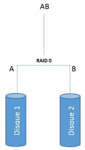
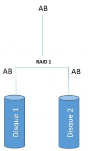
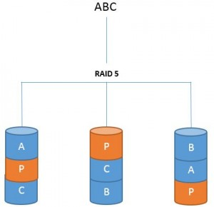
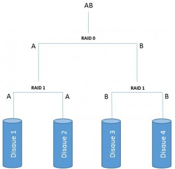
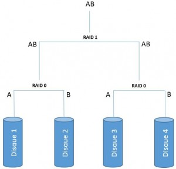
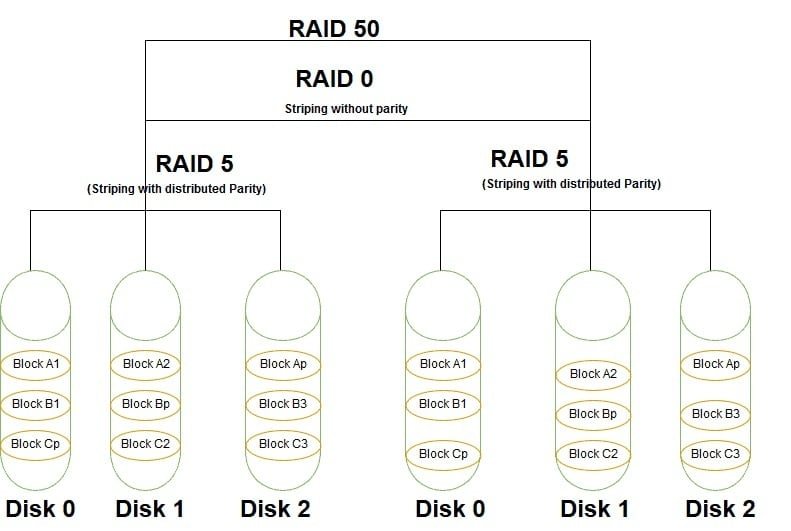

# Redondance matérielle

Qu’est-ce que la redondance matérielle ?
Pour la protection des données, la redondance matérielle constitue une mesure préventive.
Elle augmente la disponibilité des données en réduisant les risques de perte de données et
d’interruption de service.
Elle consiste à dupliquer certains composants d’un système informatique. Cela permet un
basculement (failover) sur un composant passif en cas de panne du composant actif, ou
une répartition de charge (load balancing) si tous les composants sont actifs.
Exemples de redondance matérielle :
Alimentation de secours (UPS) et alimentations redondantes
Redondance d’interfaces et d’équipements réseau (LACP, STP, etc.)
Redondance de disques (RAID, etc.)
Redondance de la mémoire vive (mémoire ECC, RAIM, etc.)
Redondance de systèmes informatiques complets (grappe de serveurs ou cluster)
Dans la suite de la présentation, notre attention va se porter sur les RAID et les clusters

## RAID
Un RAID (Redundant Array of Independent Disks) est une technologie de stockage qui
combine plusieurs disques durs ou SSD en une seule unité logique pour augmenter la
tolérance aux pannes et les performances.
Il existe plusieurs niveaux de RAID, chacun offrant différents avantages et compromis. Les
plus courants sont :
RAID 0 : agrégation par bande (striping), pas de redondance.
RAID 1 : miroir (mirroring)
RAID 5, RAID 6 : agrégation par bande avec parité simple (RAID 5) ou double (RAID 6)
RAID 10, RAID 50, RAID 60 : agrégation par bande (RAID 0) sur plusieurs unités
logiques identiques (RAID 1, RAID 5 ou RAID 6)

## RAID 0
Un RAID 0 combine deux disques ou plus en une unité logique, sans aucune redondance.
Ce n’est donc pas vraiment un RAID.
Ne peut être utilisé que dans des situations où
seule la performance compte.
Pas de tolérance de panne et la fiabilité diminue
avec l’augmentation du nombre de disques*
.
Agrégation par bande (striping) : les disques sont divisés en blocs de 128 à 512 kB. On
remplit d’abord le 1er bloc de chaque disque, puis le 2e bloc de chaque disque, etc.,
pour former des bandes (stripes).
Dans un contexte de la protection des données, le RAID 0 n’a pas d’utilité, mais l’agrégation
par bande est mise en œuvre dans tous les autres niveaux de RAID à l’exception du RAID 1.
* Si un disque unique a un taux de panne annuel de 0.93%, celui d’un RAID 0 de 6 disques est de 5.5%

la configuration RAID 0 permet d'améliorer la performance du système en répartissant 50% des données sur un disque et 50% sur l'autre.
Les deux disques travaillant simultanément, on dispose ainsi de performances deux fois plus élevée.
Soit une donnée A et une donnée B :

• Volumétrie utile = Volumétrie totale
Les données n'étant pas dupliquées, il n'y aura pas de perte de volume stokage.

• Sécurité des données : FAIBLE
Il est fortement déconseillé d'utiliser cette configuration pour des serveurs assurant les services critiques de votre entreprise. Les données n'étant à aucuns moments dupliquées seront perdues si un des deux disques venait à être défectueux.

• Fonctionne uniquement sur deux disques

## RAID 1

Un RAID 1 combine deux disques — parfois trois, rarement plus — en une unité logique. Les
disques sont des miroirs les uns des autres.
Tolérance de panne : Tolère la perte de n – 1
disques (n est le nombre de disques). Fiabilité très
supérieure à celle d’un disque unique.
Performances : Potentiellement supérieur en
lecture, similaire en écriture.
Coût : Au moins 50% de l’espace de stockage
installé.
Le contrôleur écrit les données sur tous les disques, simultanément, au même
emplacement, mais il peut lire, en même temps, un emplacement différent sur chaque
disque.

La configuration RAID 1 permet de sécuriser un système en disposant de deux disques avec exactement les mêmes données. Dans cette configuration on ne recherche pas la performance mais plutôt la sécurité.
Soit une donnée A et une donnée B :

• Volumétrie utile = Volumétrie totale / 2
Le disque 1 contenant exactement les mêmes données que le disque 2, la volumétrie utile sera divisée par 2.

• Sécurité des données : BONNE
Si un disque venait à être défaillant, cela ne poserait pas de problèmes car le second prendrait directement le relais.

## RAID 5

La configuration RAID 5, par un système de parité, répartit une petite partie des données sur chaque disque.
Dans cette configuration, ce n'est pas la performance qu'on recherche mais plutôt la sécurité tout en économisant le volume de stockage.
Soit une donnée A, une donnée B et une donnée C :

• Volumétrie utile = Nombre de disques - 1 X capacité d'un disque
Pour 3 disques de 200 Go, on aurait ainsi 3 -1 X 200 = 400 Go de volumétrie utile.

• Sécurité des données : CORRECTE
Dans cette configuration, on ne peut se permettre de perdre qu'un seul disque.

• Nombre de disques nécessaires : Au moins 3

## RAID 6

Un RAID 6 combine au moins quatre disques en une unité logique. Utilise l’agrégation par
bande (striping) avec deux blocs de parité par bande. Ces blocs sont répartis sur les
disques de manière cyclique .
Tolérance de panne : Tolère la perte de deux
disques. Fiabilité très supérieure à celle d’un
disque unique.
Performances : Augmentent avec le nombre de
disques en lecture, moins bonne en écriture.
Coût : Espace de stockage de deux disques, quel que soit le nombre de disques. Le
coût diminue avec l’augmentation du nombre de disques, mais la fiabilité également.
Remarque : Avec un seul bloc de parité, le RAID 5 a un coût moins élevé, mais il est limité en pratique à une
capacité maximale d’environ 10 TB. Au-delà, le risque de panne d’un second disque ou d’erreur non récupérable
lors de la reconstruction après la panne d’un disque devient trop grand.

## RAID combinés

Les niveaux de RAID 10 et 60 consistent à faire un RAID 0 avec des unités logiques (RAID 1
ou RAID6) dans le but d’obtenir à la fois de bonnes performances en lecture et en écriture
et une tolérance de panne.
Raid 10 : très bonnes performances, coût élevé (50% de l’espace de stockage)
RAID 60 : bon compromis entre performances et coût (deux disques par unité logique)

### RAID 10

La configuration RAID 10 répartit dans une première grappe les données en RAID 0, et dans une seconde grappe temps en RAID 1.
Celle-ci permet ainsi de disposer du niveau de sécurité de la configuration RAID 1 avec les performances qu'offre la configuration RAID 0.
Soit une donnée A et une donnée B :

• Volumétrie utile = Volumétrie totale / 2

• Sécurité des données : BONNE
Cette configuration offre un très bon niveau de sécurité car pour qu'une défaillance globale apparaisse, il faudrait que tous les éléments d'une grappe présentent un défaut en même temps.

• Nombre de disques nécessaires : Au moins 4

### RAID 01

A l'inverse de la configuration RAID 10, le RAID 01 répartit dans une première grappe les données en RAID 1, puis dans une seconde grappe en RAID 0.
Soit une donnée A et une donnée B :

• Volumétrie utile = Volumétrie totale / 2

• Sécurité des données : MOYENNE
Dans cette configuration, si un disque présente un défaut, il entraîne une une défaillance de toute la grappe et altère donc la performance du système.

### RAID 50

| critères | RAID 10 | RAID 50 |
| :------------------------------------- | --------------------------------------------------------------------------------------------------------------------------------------------------------------------------------------- | ------------------------------------------------------------------------------------------------------------------------------------------------------------------------------------------------------------------- |
| COmbinaisons de niveaux de RAID | RAID 1 + o | RAID 5 + RAID 0, 2 disques de matrice RAID 5 |
| Total des disques | Nécessite seulement 4 disques pour la configuration | Minimum de 6 disques pour la mise en œuvre|
| Technique | Combinaison de la mise en miroir et du striping sans parité | Combinaison de striping avec parité et striping sans parité |
| Redondance des données | Moins de redondance des données en raison de l'absence de parité | Meilleure redondance des données |
| Vitesse d'écriture et de lecture | Vitesse d'écriture lente mais même vitesse de lecture que RAID 10 | Grande vitesse d'écriture et de lecture |
| Performance | Haute performance, mais moins que le RAID 50 | Haute performance |
| Gestion de l'espace de stockage | Moins d'espace de stockage libre car il utilise presque deux disques pour copier les données | Il dispose d'une grande quantité d'espace libre |
| Récupération de fichiers ou de données | La récupération de fichiers sur un disque endommagé est plus rapide avec la technique de mise en miroir. Pourtant, la récupération n'est pas possible si deux disques tombent en panne. | Il prend en charge la récupération des fichiers mais prend beaucoup de temps car il doit effectuer un calcul de parité. Même si deux ou plusieurs disques sont endommagés, la récupération des données est possible |
| Coût | Économique car il ne nécessite que 4 disques | Coûteux en raison de la mise en œuvre de 6 tableaux et du contrôleur RAID |
| Utilisations | Serveurs de production et d'hébergement | Utilisation par les entreprises |

## Gestion

La gestion de volumes RAID peut être réalisée soit par un contrôleur RAID matériel, soit par
le système d’exploitation avec une configuration matérielle JBOD (just a bunch of disks).
Les systèmes d’exploitation modernes disposent également de solutions de virtualisation
du stockage, qui permettent une gestion plus souple des volumes tout en assurant la
redondance des données. Par exemple :
Windows Server Storage Spaces
LVM (Logical Volume Manager) sous Linux
ZFS (Zettabyte File System)
Enfin, on peut mentionner les solutions de stockage distribué comme Ceph ou VMware
vSAN, qui reposent sur la redondance de systèmes informatiques complets.

## Redondance

Plusieurs systèmes informatiques redondants utilisés comme une seule entité constituent
ce que l’on appelle une grappe de serveurs (cluster). Par exemple :
Cluster de cibles iSCSI : baie de stockage (storage array) dans un SAN.
Cluster de stockage : système de stockage distribué (Ceph, vSAN, etc.)
Cluster de base de données : réplication de bases de données.
Cluster de serveur de fichier : réplication de fichiers.
Dans une grappe de serveur, un système individuel est appelé un nœud (node). Le plus
souvent, chaque nœud est équipé de composants matériels redondants : alimentation,
interfaces réseau, RAID.
On utilise un répartiteur de charge (load balancer) ou un proxy inverse pour distribuer les
requêtes aux différents nœuds, ou un gestionnaire de ressource (cluster resource manager)
pour automatiser le basculement (failover) vers un nouveau nœud actif.

## Synchronisation des données

Dans un cluster de base de données ou de serveurs de fichier, chaque système contient une
copie des données appelée réplica. Un mécanisme de synchronisation des données
maintient la cohérence (consistency) entre les réplicas.
Réplication primaire-secondaire (unidirectionnelle) : les données du système
secondaire sont synchronisées avec celle du système primaire (données de référence).
Pour assurer la cohérence, le système secondaire doit être en lecture seule. Il peut y
avoir plusieurs systèmes secondaires.
Réplication primaire-primaire (bidirectionnelle) : les données de tous les systèmes
peuvent être modifiées et les données d’un système doivent être synchronisées avec
celle de tous les autres. Des conflits peuvent survenir et leur résolution ne peut pas
toujours être automatisée.
On peut utiliser des mécanismes de synchronisation similaires pour synchroniser des
fichiers

La synchronisation du répertoire personnel permet aux utilisateur·rice·s de disposer de leurs
documents sur tous leurs ordinateurs personnels (ordinateur portable, ordinateur de bureau,
etc.), et offre une protection contre la perte de données en cas de panne.
Pour cela, on peut synchroniser les données :
Vers un serveur de fichiers sur site :
Unison, rsync, lsyncd, etc.
Vers un service d’hébergement de fichier (file-hosting service) en ligne :
sur site : NextCloud, OwnCloud, Seafile, etc.
public : OneDrive, Google Drive, DropBox, etc.
Peu de risque de conflit puisque l’on ne travaille pas simultanément sur plusieurs machines.

L’utilisation de répertoires partagés dans un serveur de fichiers permet souvent d’améliorer
la protection des données en facilitant notamment le contrôle d’accès et la sauvegarde.
Toutefois, en cas de panne d’un serveur de fichier, il peut être utile de disposer d’une copie
du répertoire partagé sur un autre serveur de fichier afin d’éviter une interruption de service.
Pour cela, on peut synchroniser les données :
entre les différents nœuds d’un cluster de serveurs de fichiers sur site (on premise)
avec un service de partage de fichier hébergé (Microsoft Azur Files, Amazon S3 File
Gateway, Google Cloud Filestore, etc.) qui supporte les protocoles SMB et NFS.

## Conformité

La synchronisation des données dans le Cloud peut poser des problèmes de conformité aux
exigences de la protection des données.
En particulier, l’utilisation de service d’hébergement de fichier en ligne personnel en milieu
professionnel fait courir le risque de stocker des données personnelle ou sensible sur des
serveurs soumis au Patriot Act qui en autorise l’accès au gouvernement étasunien.
Pour un usage professionnel, ces services doivent :
Offrir des garanties quant à la localisation des données sur le territoire national
Permettre la gestion des clés de chiffrement par le client (tenant).

## Gestion des versions

La synchronisation des fichiers n’est pas une sauvegarde. Si un fichier est accidentellement
modifié ou supprimé sur l’un des systèmes synchronisés, il est également sur les autres.
Pour mitiger le risque de perte de données, les services d’hébergement de fichiers ont
généralement deux mécanismes :
Gestion de version : permets de revenir à une version précédente d’un fichier. En
principe une nouvelle version est créée à chaque modification enregistrée.
Corbeille : permets de restaurer un fichier supprimé par erreur. La corbeille est
généralement vidée automatiquement après un certain nombre de jours.
Ces deux mécanismes permettent de réduire le risque de perte de données accidentelles,
mais cela n’élimine pas les autres risques (malware, sabotage, etc.).
Pour mitiger ces risques, il est nécessaire d’avoir une copie des données figée dans le
temps sur un autre support : une sauvegarde.

