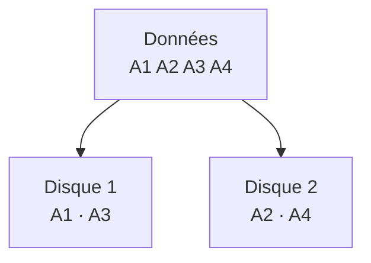

Nous avons vu la notion de RAID en cours.
je veux savoir:

    À quoi ça sert
    les différences entre les raid
    les différents raids composés Donne moi une synthèse

12 juin
RAID — Synthèse
À quoi ça sert ?

Le RAID (Redundant Array of Independent Disks) permet de combiner plusieurs disques physiques en un seul volume logique, avec deux objectifs principaux :

    Tolérance aux pannes : survivre à la défaillance d'un ou plusieurs disques
    Performance : augmenter les débits en lecture/écriture par parallélisation

Les RAID de base
Niveau	Nom	Disques min.	Tolérance	Performance	Capacité utile
RAID 0	Striping	2	❌ aucune	⬆⬆ lecture + écriture	100%
RAID 1	Mirroring	2	✅ 1 disque	⬆ lecture	50%
RAID 5	Striping + parité	3	✅ 1 disque	⬆ lecture	(n-1)/n
RAID 6	Striping + double parité	4	✅ 2 disques	➡ lecture	(n-2)/n
RAID 0 — Striping

Les données sont découpées en blocs et répartis sur tous les disques en parallèle. Aucune redondance : si un disque tombe, tout est perdu. Utilisé pour la performance pure (montage vidéo, cache temporaire).

```
Données : [A1][A2][A3][A4]
Disque 1 : [A1][A3]
Disque 2 : [A2][A4]
```

RAID 1 — Mirroring

Chaque donnée est écrite simultanément sur deux disques (copie exacte). Survit à la perte d'un disque. Capacité réduite de moitié.
```
Données : [A]
Disque 1 : [A]
Disque 2 : [A]  ← copie exacte
```

RAID 5 — Striping + parité distribuée

Les données et un bloc de parité (XOR) sont répartis sur tous les disques. Permet de reconstruire les données si un disque tombe. Bon compromis performance/redondance/capacité.
```
Disque 1 : [A1][B1][P_C]
Disque 2 : [A2][P_B][C1]
Disque 3 : [P_A][B2][C2]
            ↑ parité tournante
```
RAID 6 — Double parité

Comme le RAID 5 mais avec deux blocs de parité indépendants. Survit à la perte de 2 disques simultanément. Plus lent en écriture.
Les RAID composés (nested RAID)

Ces niveaux combinent deux RAID pour cumuler leurs avantages.
RAID 10 (1+0)

    Mirroring puis Striping

On crée des paires miroir (RAID 1), puis on stripe (RAID 0) entre elles.

```
        RAID 0 (striping)
       ┌──────┴──────┐
    Paire 1       Paire 2
   [D1 | D2]    [D3 | D4]
  RAID1 miroir  RAID1 miroir
```

    ✅ Survit à 1 disque par paire (jusqu'à 2 disques dans le meilleur cas)
    ✅ Très bonnes performances en lecture ET écriture
    ❌ Capacité utile = 50%
    📌 Idéal pour les bases de données à forte charge

RAID 01 (0+1)

    Striping puis Mirroring

On stripe d'abord, puis on duplique le groupe entier.
```
        RAID 1 (miroir)
       ┌──────┴──────┐
   Groupe 1       Groupe 2
  [D1 | D2]    [D3 | D4]
  RAID0 stripe  RAID0 stripe
```

    ⚠️ Si un disque du groupe 1 tombe → tout le groupe est perdu, seul le groupe 2 reste
    ❌ Moins résilient que le RAID 10
    📌 Moins utilisé en pratique

RAID 50 (5+0)

    RAID 5 en stripe

Plusieurs groupes RAID 5 sont striés ensemble. Améliore les performances du RAID 5 sur de grands volumes.

    ✅ Tolère 1 disque par groupe RAID 5
    ✅ Meilleures performances qu'un RAID 5 simple
    📌 Utilisé pour les grands stockages (NAS, SAN)

RAID 60 (6+0)

    RAID 6 en stripe

Comme le RAID 50 mais avec double parité par groupe. Tolère 2 disques défaillants par groupe.

    ✅ Très haute disponibilité
    ❌ Coût élevé (nombreux disques requis)
    📌 Environnements critiques (archivage, datacenters)

Résumé comparatif
RAID	Redondance	Perf. lecture	Perf. écriture	Capacité	Usage typique
0	❌	⬆⬆	⬆⬆	100%	Cache, vidéo
1	✅ 1 disque	⬆	➡	50%	OS, petits serveurs
5	✅ 1 disque	⬆	➡	(n-1)/n	Serveurs fichiers
6	✅ 2 disques	⬆	⬇	(n-2)/n	Archivage
10	✅ 1/paire	⬆⬆	⬆	50%	BDD, prod critique
50	✅ 1/groupe	⬆⬆	⬆	bonne	NAS, SAN
60	✅ 2/groupe	⬆⬆	➡	correcte	Datacenter

l'utilisation de RAID n'a rien à voir avec la sauvegarde ?
12 juin

Exactement, c'est une confusion très fréquente.

Le RAID protège contre la panne matérielle d'un disque — il maintient le système disponible sans interruption. Mais il ne protège pas contre :

    la suppression accidentelle d'un fichier (effacé sur un disque → effacé sur tous)
    la corruption de données (un ransomware chiffre tout → répliqué partout)
    le vol ou sinistre physique (incendie, inondation → tous les disques perdus ensemble)
    une erreur humaine (mauvaise manipulation → propagée instantanément)

    Le RAID garantit la disponibilité, la sauvegarde garantit la récupérabilité.

Ce sont deux couches complémentaires, pas interchangeables. Un bon système de protection des données a les deux — typiquement résumé par la règle 3-2-1 :

    3 copies des données
    sur 2 supports différents
    dont 1 hors site

crée moi des schémas en mermaid de ces différents raid
12 juin

Voilà les schémas Mermaid pour chaque niveau de RAID :
RAID 0 — Striping


RAID 1 — Mirroring
DonnéesADisque 1A
Disque 2A ← copie exacte
RAID 5 — Striping + parité distribuée
Données + Parité XORDisque 1A1 · B1 · PcDisque 2A2 · Pb · C1Disque 3Pa · B2 · C2
Pa/Pb/Pc = blocs de paritétournants
RAID 6 — Double parité
Données + 2x ParitéDisque 1A1 · P1Disque 2A2 · P2Disque 3A3 · Q1Disque 4A4 · Q2
P = parité 1 / Q = parité 2
RAID 10 — Mirror + Stripe
DonnéesRAID 0 - StripingPaire 1RAID 1Paire 2RAID 1Disque 1Disque 2miroir de D1Disque 3
Disque 4miroir de D3
RAID 01 — Stripe + Mirror
DonnéesRAID 1 - MirroringGroupe 1RAID 0Groupe 2RAID 0copie exacteDisque 1Disque 2Disque 3
Disque 4
RAID 50 — RAID 5 + Stripe
DonnéesRAID 0 - StripingGroupe 1RAID 5Groupe 2RAID 5Disque 1Disque 2Disque 3paritéDisque 4Disque 5
Disque 6parité
RAID 60 — RAID 6 + Stripe
DonnéesRAID 0 - StripingGroupe 1RAID 6Groupe 2RAID 6Disque 1Disque 2Disque 3parité PDisque 4parité QDisque 5Disque 6Disque 7parité P
Disque 8parité Q

Ces schémas montrent bien la hiérarchie dans les RAID composés : on voit clairement que le RAID 10 et le RAID 01 ont la même structure physique mais une organisation logique inversée, ce qui explique leur différence de résilience.

explique avec ces exemple le failover et le load balancing
12 juin
Failover et Load Balancing — avec les RAID comme exemple
Failover (basculement)

Le failover c'est la capacité d'un système à continuer de fonctionner automatiquement après la panne d'un composant, en basculant sur un composant de secours.

Exemple avec le RAID 1 :
```
État normal :
Disque 1 [A] ← lecture/écriture
Disque 2 [A] ← en attente (miroir)
```
```
Panne du disque 1 :
Disque 1 [✗] ← mort
Disque 2 [A] ← prend le relais automatiquement
               ↑ failover transparent pour l'utilisateur
```
Exemple avec le RAID 5 :
```
État normal :
Disque 1 [A1][B1][Pc]
Disque 2 [A2][Pb][C1]  ← tous actifs
Disque 3 [Pa][B2][C2]
```
```
Panne du disque 2 :
Disque 1 [A1][B1][Pc]
Disque 2 [ ✗ ]          ← mort
Disque 3 [Pa][B2][C2]  ← A2 et C1 reconstruits via XOR
                           ↑ failover par recalcul de parité
```

    Le système ne s'arrête pas — il reconstruit les données manquantes à la volée.

Load Balancing (répartition de charge)

Le load balancing c'est la distribution du travail sur plusieurs composants en parallèle pour éviter qu'un seul soit saturé et améliorer les performances globales.

Exemple avec le RAID 0 :
```
Requête lecture [A1][A2][A3][A4]

Sans RAID 0 (1 disque) :
Disque 1 → [A1] → [A2] → [A3] → [A4]   (séquentiel)
Temps : ████████████████
```
```
Avec RAID 0 (2 disques) :
Disque 1 → [A1] → [A3]
Disque 2 → [A2] → [A4]   (parallèle)
Temps : ████████
         ↑ charge divisée par 2
```

Exemple avec le RAID 5 :

3 requêtes simultanées :

Disque 1 → répond à requête 1
Disque 2 → répond à requête 2
Disque 3 → répond à requête 3

↑ aucun disque ne traite tout seul
  la charge est répartie équitablement

Les deux combinés — RAID 10

Le RAID 10 est l'exemple parfait qui cumule les deux :
```
Requête lecture :
        RAID 0
       ┌──────┴──────┐
    Paire 1       Paire 2       ← load balancing entre paires
   [D1 | D2]    [D3 | D4]
      ↕              ↕
  l'un ou l'autre  l'un ou l'autre  ← failover au sein de chaque paire
```

Panne de D1 :
```
        RAID 0
       ┌──────┴──────┐
    [✗  | D2]    [D3 | D4]
          ↑
     failover → D2 prend le relais
     load balancing → continue sur les 2 paires

    Le load balancing reste actif même après un failover — c'est pourquoi le RAID 10 est privilégié en production.
```
Résumé conceptuel
Concept	Objectif	Question à laquelle il répond
Failover	Continuité de service	"Et si ça tombe ?"
Load balancing	Performance & scalabilité	"Et si c'est saturé ?"

Ces deux concepts dépassent largement le RAID — on les retrouve dans les clusters de serveurs, les réseaux (DNS, proxys), les applications web (plusieurs instances derrière un load balancer), etc. Le RAID n'est qu'un exemple concret au niveau du stockage.

donne moi le code des schémas en mermaid pour compléter mes notes
12 juin

Voilà tous les codes Mermaid prêts à coller dans Obsidian :
Failover — RAID 1 (état normal)
miroirClientDisque 1actif
Disque 2en attente
Failover — RAID 1 (après panne)
ClientDisque 1✗ mort
Disque 2✓ prend le relais
Failover — RAID 5 (après panne)
ClientDisque 1A1 · B1 · PcDisque 2✗ mortDisque 3Pa · B2 · C2
Reconstruction XORA2 et C1 recalculés
Load Balancing — RAID 0
Requête lectureA1 A2 A3 A4Disque 1A1 · A3Disque 2A2 · A4
Résultat assembléA1 A2 A3 A4
Load Balancing — RAID 5
Requête 1Disque 1Requête 2Disque 2Requête 3
Disque 3parité
Failover + Load Balancing — RAID 10 (état normal)
ClientRAID 0Load BalancingPaire 1RAID 1Paire 2RAID 1Disque 1Disque 2miroirDisque 3
Disque 4miroir
Failover + Load Balancing — RAID 10 (après panne)
ClientRAID 0Load Balancing maintenuPaire 1RAID 1Paire 2RAID 1Disque 1✗ mortDisque 2✓ failoverDisque 3
Disque 4

pour le raid 6: une parité est un élément XOR de A1 + A2 ?
12 juin

Oui, c'est exactement ça pour P (parité simple, comme en RAID 5).

Mais le RAID 6 ajoute une deuxième parité Q qui utilise un algorithme différent — Reed-Solomon — car si on faisait juste deux XOR, on ne pourrait pas distinguer lequel des deux disques est tombé lors d'une double panne.

```
Disques :    D1    D2    D3    P         Q
Données :    A1    A2    A3    
                               
P (XOR) :                      A1⊕A2⊕A3
Q (Reed-Solomon) :                       f(A1,A2,A3)

    P = XOR simple → permet de reconstruire 1 disque perdu
    Q = calcul polynomial → permet de reconstruire même si P est aussi perdu
```
En résumé :
Panne	Utilisé
1 disque de données	P suffit
2 disques de données	P + Q ensemble
P perdu + 1 disque	Q prend le relais

C'est ce qui permet au RAID 6 de survivre à 2 pannes simultanées, ce que le XOR seul ne permettrait pas.

peux tu me refaire les schéma en incroporant cette données ?
12 juin

je n'ai pas bien compris le read solomon.

le disques peucent se reconstruire à partir de la parité, pourquoi ne pas l'utiliser partout ?
12 juin
Reed-Solomon — pourquoi XOR ne suffit pas
Le problème avec deux pannes et XOR

Imagine 3 disques + P (XOR) :
```
D1=3   D2=5   D3=6   P=3⊕5⊕6=0
```
Si D1 et D2 tombent en même temps :
```
D1=?   D2=?   D3=6   P=0
```
On sait que : D1⊕D2⊕6 = 0
Donc        : D1⊕D2   = 6

→ infinité de solutions : (1,7) (2,4) (3,5)...
   impossible de savoir lequel est D1 et lequel est D2

    XOR donne une somme sans identité — on ne peut pas résoudre deux inconnues avec une seule équation.

Ce que Reed-Solomon apporte

Reed-Solomon traite les données comme des points sur une courbe polynomiale. Chaque disque est une valeur de ce polynôme.
```
Polynôme :  f(x) = A1·x² + A2·x + A3

D1 = f(1)
D2 = f(2)
D3 = f(3)
P  = f(4)   ← parité XOR
Q  = f(5)   ← point supplémentaire sur la courbe
```
Avec 2 points connus, on peut toujours reconstruire un polynôme de degré 2 — c'est un théorème mathématique.

2 disques perdus = 2 inconnues
P + Q            = 2 équations indépendantes
→ système soluble, solution unique

Pourquoi ne pas utiliser RS partout alors ?
XOR (P)	                Reed-Solomon (Q)
Calcul	Ultra rapide	Coûteux en CPU
Reconstruction	Simple	Complexe
Tolère	1 panne	        2 pannes

En RAID 5, XOR est suffisant et quasi gratuit en performance. Ajouter RS sans nécessité alourdirait inutilement chaque écriture.

    C'est un compromis coût/bénéfice : on n'utilise RS que quand on a besoin de tolérer 2 pannes simultanées, car il coûte cher à chaque opération d'écriture.

crée moi un document .md avec ces informations et les diagrammes en mermaid (mermaid )
12 juin
Consulté un fichier, fichier créé, lu un fichier

Le fichier est prêt. Il contient toute la synthèse de la conversation : les RAID de base, les RAID composés, la parité XOR, Reed-Solomon avec l'explication mathématique, et tous les schémas Mermaid optimisés pour Obsidian.
Raid synthese
Document · MD 

la parité XOR peut aussi être représenté 

graph LR
    D[Données] --> D1[D1
    A1 + (A2 + A3)]
    D --> D2[D2
    A2 + (A1+A3)]
    D --> D3[D3
    A3 + (A1+A2)]

?
12 juin

Non, ce n'est pas correct. Ce que tu décris là c'est chaque disque qui contient à la fois sa donnée ET la parité des autres — ça n'existe pas en RAID 5.

En RAID 5, la parité est un bloc séparé qui tourne entre les disques :

Stripe 1 :  D1=A1   D2=A2   D3=A3   P=A1⊕A2⊕A3
Stripe 2 :  D1=B1   D2=B2   P=B1⊕B2⊕B3   D3=B3
Stripe 3 :  D1=C1   P=C1⊕C2⊕C3   D2=C2   D3=C3

La parité tourne pour ne pas surcharger un seul disque en écriture. Donc le schéma correct reste :
DonnéesD1A1D2A2D3A3
PA1⊕A2⊕A3

P est un disque logique dédié à la parité pour ce stripe — pas une propriété de chaque disque.

si elle n'est pas sur les disques physique, où se trouve-elle ?
12 juin

Bonne question — elle est bien sur les disques physiques, mais j'ai mal formulé.

La parité tourne entre les disques physiques selon les stripes :

           D1        D2        D3
Stripe 1 [ A1    ][ A2    ][ A1⊕A2 ]  ← P sur D3
Stripe 2 [ B1    ][ B1⊕B2 ][ B2    ]  ← P sur D2
Stripe 3 [ C1⊕C2 ][ C1    ][ C2    ]  ← P sur D1

Donc sur chaque disque physique on trouve un mélange de données et de blocs de parité selon le stripe concerné. Aucun disque n'est dédié uniquement à la parité — c'est précisément ce qui distingue le RAID 5 d'un RAID 4 (où un disque entier est dédié à P).

Le schéma Mermaid que j'avais fait était donc une simplification trompeuse — il laissait penser que P est un disque séparé. Un schéma plus fidèle serait :
Stripe 1D1: A1D2: A2D3: A1⊕A2Stripe 2D1: B1D2: B1⊕B2
D3: B2

Les blocs oranges sont les blocs de parité — ils sont bien physiquement sur les disques, mais ils tournent d'un disque à l'autre à chaque stripe.

corrige le document avec ces nouvelles information et mets à jour les diagrammes
12 juin
5 fichiers modifiés, consulté un fichier, lu un fichier

Document mis à jour. Les changements principaux :

    RAID 5 : le schéma montre maintenant la parité qui tourne stripe par stripe entre D1, D2, D3 — avec les blocs de parité en orange sur chaque disque
    RAID 6 : idem avec P (orange) et Q (bleu) qui tournent tous les deux
    RAID 50/60 : les disques indiquent maintenant données+P pour refléter que chaque disque porte un mix des deux
    Failover RAID 5 : le schéma précise que la reconstruction fonctionne peu importe si le bloc perdu est une donnée ou un bloc de parité

Raid synthese
Document · MD 

enlève les \n dans les diagrammes. Obsidian ne les comprends pas
12 juin
A consulté 2 fichiers, a exécuté une commande, lu un fichier

Tous les \n dans les labels Mermaid ont été remplacés par des espaces. Les labels comme [D1\nactif] deviennent [D1 actif] — propre et compatible Obsidian.
Raid synthese
Document · MD 

je ne comprends toujours pas bien cette partie.
Les données et un bloc de parité (XOR) sont répartis sur tous les disques. La parité tourne entre les disques physiques à chaque stripe — aucun disque n'est dédié uniquement à la parité. Chaque disque contient donc un mélange de blocs de données et de blocs de parité selon le stripe concerné.
C'est ce qui distingue le RAID 5 du RAID 4, où un disque entier est dédié à la parité.

graph TD
    S1[Stripe 1] --> A1[D1: A1]
    S1 --> A2[D2: A2]
    S1 --> A3[D3: A1⊕A2]
    S2[Stripe 2] --> B1[D1: B1]
    S2 --> B2[D2: B1⊕B2]
    S2 --> B3[D3: B2]
    S3[Stripe 3] --> C1[D1: C1⊕C2]
    S3 --> C2[D2: C1]
    S3 --> C3[D3: C2]
    style A3 fill:#ffaa00,color:#000
    style B2 fill:#ffaa00,color:#000
    style C1 fill:#ffaa00,color:#000

Les blocs oranges sont les blocs de parité — physiquement stockés sur les disques, mais répartis sur chacun d'eux selon une rotation.
---
un strip est une couche du disque ?
12 juin

Pas tout à fait. Voilà comment ça s'organise :

Un bloc = la plus petite unité de données écrite sur un disque (ex. 64 Ko)

Un stripe = une "rangée" de blocs répartis sur tous les disques en même temps

           D1      D2      D3
Stripe 1 [ A1  ][ A2  ][ P   ]   ← une rangée = 1 stripe
Stripe 2 [ B1  ][ P   ][ B2  ]
Stripe 3 [ P   ][ C1  ][ C2  ]

Donc sur le disque physique D1, tu as empilés verticalement :

D1 (disque physique)
├── bloc A1   (données du stripe 1)
├── bloc B1   (données du stripe 2)
└── bloc P    (parité du stripe 3)

La rotation de la parité, c'est juste que le bloc P ne tombe pas toujours sur le même disque :

Stripe 1 → P est sur D3
Stripe 2 → P est sur D2
Stripe 3 → P est sur D1

En RAID 4, ce serait toujours :

Stripe 1 → P est sur D3
Stripe 2 → P est sur D3   ← toujours le même
Stripe 3 → P est sur D3   ← D3 surchargé

C'est pourquoi le RAID 4 crée un goulot d'étranglement sur le disque de parité — chaque écriture doit passer par lui. Le RAID 5 résout ce problème en distribuant la charge.

complète le document avec ces informations (plus le schéma texte ou mermaid selon ce qui est le plus visuel)
12 juin
Consulté un fichier, fichier modifié, lu un fichier

Section mise à jour avec les trois niveaux d'explication :

    Définitions bloc / stripe en texte simple
    Schémas ASCII pour la vue disque physique et la comparaison RAID 4 vs RAID 5 — plus lisibles que Mermaid pour ce type de tableau
    Diagramme Mermaid conservé pour la vue par stripe avec les blocs de parité en orange

Raid synthese
Document · MD 

réexplique encore la différence en parité XOR et Read solomon (avec schéma de préférence)
12 juin

La différence fondamentale c'est le nombre d'inconnues qu'on peut résoudre.
XOR — 1 équation, 1 inconnue

XOR c'est une simple addition binaire sans retenue :

0 ⊕ 0 = 0
0 ⊕ 1 = 1
1 ⊕ 0 = 1
1 ⊕ 1 = 0   ← la différence avec l'addition normale

Propriété clé : A ⊕ B ⊕ A = B — on peut retrouver n'importe quel terme si on a tous les autres.

Données :  A1=3   A2=5   A3=6
P = 3⊕5⊕6 = 0

Panne de A2 :
A1 ⊕ ? ⊕ A3 = P
3  ⊕ ? ⊕ 6  = 0
           ? = 3⊕6⊕0 = 5  ✓  → A2 retrouvé

Mais avec 2 pannes simultanées :

?  ⊕ ?  ⊕ A3 = P
?  ⊕ ?  ⊕ 6  = 0
→ infinité de solutions, impossible à résoudre

Reed-Solomon — 2 équations, 2 inconnues

Reed-Solomon modélise les données comme un polynôme dont chaque disque est un point :

Polynôme f(x) de degré 2 :
f(x) = a·x² + b·x + c

D1 = f(1) = a + b + c
D2 = f(2) = 4a + 2b + c
D3 = f(3) = 9a + 3b + c
P  = f(4) = 16a + 4b + c   ← XOR
Q  = f(5) = 25a + 5b + c   ← Reed-Solomon

En géométrie : 2 points suffisent toujours à reconstruire une droite, 3 points une parabole.

      f(x)
  *         ← Q = f(5) connu
        *   ← P = f(4) connu
  D1=?      ← perdu
      D2=?  ← perdu

→ on a encore 2 points (P et Q)
→ on peut recalculer le polynôme
→ on retrouve f(1) et f(2)  ✓

Comparaison visuelle
Reed-Solomon2 blocs de parité P+QRésout 2 pannes2 équations - 2 inconnuesmaxXOR1 bloc de parité PRésout 1 panne
1 équation - 1 inconnue max
Résumé en une phrase

    XOR c'est une soustraction — Reed-Solomon c'est un système d'équations. Plus tu as d'équations, plus tu peux retrouver d'inconnues.

	XOR	Reed-Solomon
Modèle math	A ⊕ B ⊕ ... = P	f(x) = polynôme
Pannes tolérées	1	2
Coût CPU	quasi nul	élevé
Utilisé dans	RAID 5	RAID 6 (Q uniquement)

la raid 6 a donc besoin de disque supplémetaire vu qu'il doit avoir la parité XOR et le read solomon ?
12 juin

Oui, exactement. Le RAID 6 nécessite 2 disques de parité supplémentaires par rapport aux données :

RAID 5 avec 3 disques de données :
D1   D2   D3   P
←  données →  ← 1 disque parité

RAID 6 avec 3 disques de données :
D1   D2   D3   P    Q
←  données →  ← 2 disques parité

C'est pour ça que le RAID 6 a un minimum de 4 disques (contre 3 pour le RAID 5), et que sa capacité utile est (n-2)/n au lieu de (n-1)/n.

Exemple concret avec 6 disques :

RAID 5 sur 6 disques :
D1  D2  D3  D4  D5  P
→ 5 disques utiles sur 6  (83%)

RAID 6 sur 6 disques :
D1  D2  D3  D4  P   Q
→ 4 disques utiles sur 6  (66%)

Le coût en capacité est réel — mais il se justifie dans les grands volumes où la probabilité que deux disques tombent pendant la reconstruction d'un premier devient non négligeable. Plus le volume est grand, plus la reconstruction est longue, plus le risque d'une deuxième panne pendant ce temps augmente.

et le read solomon est aussi en rotation ?
12 juin

Oui, exactement comme P. Les deux blocs P et Q tournent ensemble à chaque stripe :

           D1       D2       D3       D4
Stripe 1 [ A1   ][ A2   ][ P    ][ Q    ]
Stripe 2 [ B1   ][ P    ][ Q    ][ B2   ]
Stripe 3 [ P    ][ Q    ][ C1   ][ C2   ]
Stripe 4 [ Q    ][ D1   ][ D2   ][ P    ]

Chaque disque physique contient donc un mix des quatre types de blocs :

D1 (disque physique)
├── A1   (données, stripe 1)
├── B1   (données, stripe 2)
├── P    (parité XOR, stripe 3)
└── Q    (Reed-Solomon, stripe 4)

La logique est la même qu'en RAID 5 — distribuer la charge sur tous les disques pour éviter qu'un seul soit surchargé. Ici on distribue deux blocs de parité au lieu d'un, mais le principe de rotation reste identique.

peux-tu créer les schémas en code ASCII ?
12 juin

Voilà tous les schémas en ASCII :
RAID 5 — rotation de la parité P

           D1        D2        D3
         +--------+--------+--------+
Stripe 1 |  A1    |  A2    | [P]    |
         +--------+--------+--------+
Stripe 2 |  B1    | [P]    |  B2    |
         +--------+--------+--------+
Stripe 3 | [P]    |  C1    |  C2    |
         +--------+--------+--------+

[P] = bloc de parité XOR

RAID 6 — rotation de P et Q

           D1        D2        D3        D4
         +--------+--------+--------+--------+
Stripe 1 |  A1    |  A2    | [P]    | [Q]    |
         +--------+--------+--------+--------+
Stripe 2 |  B1    | [P]    | [Q]    |  B2    |
         +--------+--------+--------+--------+
Stripe 3 | [P]    | [Q]    |  C1    |  C2    |
         +--------+--------+--------+--------+
Stripe 4 | [Q]    |  D1    |  D2    | [P]    |
         +--------+--------+--------+--------+

[P] = parité XOR     [Q] = Reed-Solomon

Contenu d'un disque physique (RAID 6)

D1 (disque physique)
+---------------------------+
| stripe 1 |  A1  (données) |
+---------------------------+
| stripe 2 |  B1  (données) |
+---------------------------+
| stripe 3 | [P]  (XOR)     |
+---------------------------+
| stripe 4 | [Q]  (RS)      |
+---------------------------+

RAID 4 vs RAID 5 — goulot d'étranglement

RAID 4 — P toujours sur D3 :

           D1        D2        D3
         +--------+--------+--------+
Stripe 1 |  A1    |  A2    | [P]    | <-- écriture sur D3
         +--------+--------+--------+
Stripe 2 |  B1    |  B2    | [P]    | <-- écriture sur D3
         +--------+--------+--------+
Stripe 3 |  C1    |  C2    | [P]    | <-- écriture sur D3
         +--------+--------+--------+
                              ^^^^
                         D3 surchargé


RAID 5 — P tourne entre les disques :

           D1        D2        D3
         +--------+--------+--------+
Stripe 1 |  A1    |  A2    | [P]    | <-- écriture sur D3
         +--------+--------+--------+
Stripe 2 |  B1    | [P]    |  B2    | <-- écriture sur D2
         +--------+--------+--------+
Stripe 3 | [P]    |  C1    |  C2    | <-- écriture sur D1
         +--------+--------+--------+
            ^^^^     ^^^^     ^^^^
         charge distribuée équitablement

XOR vs Reed-Solomon — résolution d'inconnues

XOR — 1 équation :

  A1 ⊕ A2 ⊕ A3 = P

  1 disque perdu :   A1 ⊕ [?] ⊕ A3 = P  →  solution unique  ✓
  2 disques perdus : [?] ⊕ [?] ⊕ A3 = P  →  impossible       ✗


Reed-Solomon — 2 équations :

  f(4) = P   (parité XOR)
  f(5) = Q   (Reed-Solomon)

  2 disques perdus = 2 inconnues
  2 équations      = système soluble        ✓

y compris raid 10 , raid 01 et raid 60 (en UTF8 pour que ce soit plus beau)
12 juin

Voilà tous les schémas en UTF-8 :
RAID 0 — Striping

         D1        D2
       ┌────────┬────────┐
       │  A1    │  A2    │
       ├────────┼────────┤
       │  A3    │  A4    │
       └────────┴────────┘
       ← données réparties en parallèle →

RAID 1 — Mirroring

         D1        D2
       ┌────────┬────────┐
       │   A    │   A    │
       ├────────┼────────┤
       │   B    │   B    │
       └────────┴────────┘
                  ↑
             copie exacte

RAID 4 vs RAID 5

RAID 4 — P toujours sur D3 :

           D1        D2        D3
         ┌────────┬────────┬────────┐
Stripe 1 │  A1    │  A2    │ ░P░    │ ← écriture sur D3
         ├────────┼────────┼────────┤
Stripe 2 │  B1    │  B2    │ ░P░    │ ← écriture sur D3
         ├────────┼────────┼────────┤
Stripe 3 │  C1    │  C2    │ ░P░    │ ← écriture sur D3
         └────────┴────────┴────────┘
                              ↑↑↑↑
                         D3 surchargé


RAID 5 — P tourne entre les disques :

           D1        D2        D3
         ┌────────┬────────┬────────┐
Stripe 1 │  A1    │  A2    │ ░P░    │ ← écriture sur D3
         ├────────┼────────┼────────┤
Stripe 2 │  B1    │ ░P░    │  B2    │ ← écriture sur D2
         ├────────┼────────┼────────┤
Stripe 3 │ ░P░    │  C1    │  C2    │ ← écriture sur D1
         └────────┴────────┴────────┘
            ↑↑↑      ↑↑↑      ↑↑↑
         charge distribuée équitablement

RAID 6 — double parité tournante

           D1        D2        D3        D4
         ┌────────┬────────┬────────┬────────┐
Stripe 1 │  A1    │  A2    │ ░P░    │ ▒Q▒    │
         ├────────┼────────┼────────┼────────┤
Stripe 2 │  B1    │ ░P░    │ ▒Q▒    │  B2    │
         ├────────┼────────┼────────┼────────┤
Stripe 3 │ ░P░    │ ▒Q▒    │  C1    │  C2    │
         ├────────┼────────┼────────┼────────┤
Stripe 4 │ ▒Q▒    │  D1    │  D2    │ ░P░    │
         └────────┴────────┴────────┴────────┘

  ░P░ = parité XOR        ▒Q▒ = Reed-Solomon

Contenu d'un disque physique (RAID 6)

  D1 (disque physique)
  ┌──────────────────────────┐
  │ stripe 1 │  A1 (données) │
  ├──────────────────────────┤
  │ stripe 2 │  B1 (données) │
  ├──────────────────────────┤
  │ stripe 3 │ ░P░ (XOR)     │
  ├──────────────────────────┤
  │ stripe 4 │ ▒Q▒ (RS)      │
  └──────────────────────────┘

RAID 10 — Mirror + Stripe

              Données
                 │
         ┌───────┴───────┐
      RAID 0 (striping)
         │               │
    ┌────┴────┐     ┌────┴────┐
    │ Paire 1 │     │ Paire 2 │
    │ RAID 1  │     │ RAID 1  │
    └────┬────┘     └────┬────┘
    ┌────┴────┐     ┌────┴────┐
    │   D1    │     │   D3    │
    │   D2    │     │   D4    │
    │(miroir) │     │(miroir) │
    └─────────┘     └─────────┘

  Panne D1 → D2 prend le relais  (failover)
  Lecture   → D1+D2 et D3+D4 en parallèle  (load balancing)

RAID 01 — Stripe + Mirror

              Données
                 │
         ┌───────┴───────┐
      RAID 1 (mirroring)
         │               │
    ┌────┴────┐     ┌────┴────┐
    │Groupe 1 │     │Groupe 2 │
    │ RAID 0  │     │ RAID 0  │
    └────┬────┘     └────┬────┘
    ┌────┴────┐     ┌────┴────┐
    │ D1 │ D2 │     │ D3 │ D4 │
    └────┴────┘     └────┴────┘
      stripe          copie exacte

  Panne D1 → tout le groupe 1 hors service
           → seul le groupe 2 reste actif  ⚠️

RAID 50 — RAID 5 + Stripe

              Données
                 │
         ┌───────┴───────┐
      RAID 0 (striping)
         │               │
    ┌────┴────┐     ┌────┴────┐
    │Groupe 1 │     │Groupe 2 │
    │ RAID 5  │     │ RAID 5  │
    └────┬────┘     └────┬────┘

  Groupe 1 :              Groupe 2 :
    D1    D2    D3          D4    D5    D6
  ┌─────┬─────┬─────┐    ┌─────┬─────┬─────┐
  │ A1  │ A2  │░P░  │    │ B1  │ B2  │░P░  │
  ├─────┼─────┼─────┤    ├─────┼─────┼─────┤
  │ C1  │░P░  │ C2  │    │ D1  │░P░  │ D2  │
  └─────┴─────┴─────┘    └─────┴─────┴─────┘
  P tourne dans chaque groupe indépendamment

RAID 60 — RAID 6 + Stripe

              Données
                 │
         ┌───────┴───────┐
      RAID 0 (striping)
         │               │
    ┌────┴────┐     ┌────┴────┐
    │Groupe 1 │     │Groupe 2 │
    │ RAID 6  │     │ RAID 6  │
    └────┬────┘     └────┴────┘

  Groupe 1 :                    Groupe 2 :
    D1    D2    D3    D4          D5    D6    D7    D8
  ┌─────┬─────┬─────┬─────┐    ┌─────┬─────┬─────┬─────┐
  │ A1  │ A2  │░P░  │▒Q▒  │    │ B1  │ B2  │░P░  │▒Q▒  │
  ├─────┼─────┼─────┼─────┤    ├─────┼─────┼─────┼─────┤
  │ C1  │░P░  │▒Q▒  │ C2  │    │ D1  │░P░  │▒Q▒  │ D2  │
  └─────┴─────┴─────┴─────┘    └─────┴─────┴─────┴─────┘
  P et Q tournent dans chaque groupe — tolère 2 pannes/groupe

XOR vs Reed-Solomon

XOR — 1 équation :
  ┌────────────────────────────────────────────┐
  │  A1 ⊕ A2 ⊕ A3 = P                         │
  │                                            │
  │  1 panne  : A1 ⊕ [?] ⊕ A3 = P  →  ✓      │
  │  2 pannes : [?] ⊕ [?] ⊕ A3 = P  →  ✗      │
  └────────────────────────────────────────────┘

Reed-Solomon — 2 équations :
  ┌────────────────────────────────────────────┐
  │  f(4) = P   (parité XOR)                   │
  │  f(5) = Q   (Reed-Solomon)                 │
  │                                            │
  │  2 disques perdus = 2 inconnues            │
  │  2 équations      = système soluble  →  ✓  │
  └────────────────────────────────────────────┘
