# Résumé
## À quoi ça sert ?

Le RAID (**Redundant Array of Independent Disks**) permet de combiner plusieurs disques physiques en un seul volume logique, avec deux objectifs principaux :

- **Tolérance aux pannes** : survivre à la défaillance d'un ou plusieurs disques
- **Performance** : augmenter les débits en lecture/écriture par parallélisation

> ⚠️ Le RAID **ne remplace pas la sauvegarde**. Il protège contre la panne matérielle, mais pas contre la suppression accidentelle, la corruption, le ransomware ou un sinistre physique. Règle **3-2-1** : 3 copies, sur 2 supports différents, dont 1 hors site.

---

## Les RAID de base

|Niveau|Nom|Disques min.|Tolérance|Performance lecture|Performance écriture|Capacité utile|
|---|---|---|---|---|---|---|
|RAID 0|Striping|2|❌ aucune|⬆⬆ (parallèle)|⬆⬆ (parallèle)|100%|
|RAID 1|Mirroring|2|✅ 1 disque|⬆ (multi-source)|➡ (double écriture)|50%|
|RAID 5|Striping + parité|3|✅ 1 disque|⬆ (parallèle)|⬇ (calcul parité)|( n−1 ) / n|
|RAID 6|Striping + double parité|4|✅ 2 disques|⬆ (parallèle)|⬇⬇ (2× parité)|( n−2 ) / n|

---

### RAID 0 — Striping

Les données sont découpées en blocs et répartis sur tous les disques en parallèle. Aucune redondance : si un disque tombe, tout est perdu. Utilisé pour la performance pure.

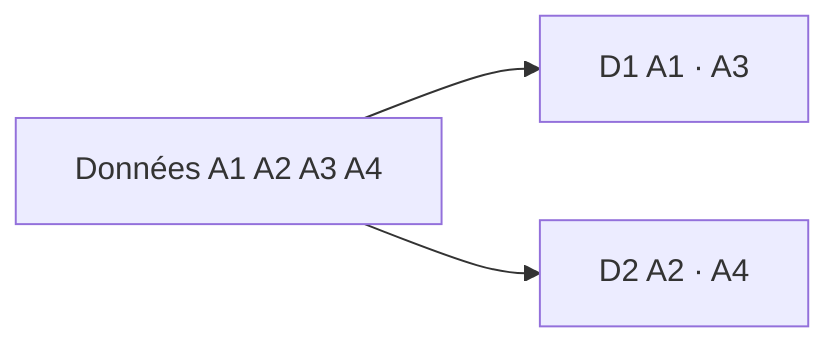

---

### RAID 1 — Mirroring

Chaque donnée est écrite simultanément sur deux disques. Survit à la perte d'un disque. Capacité réduite de moitié.

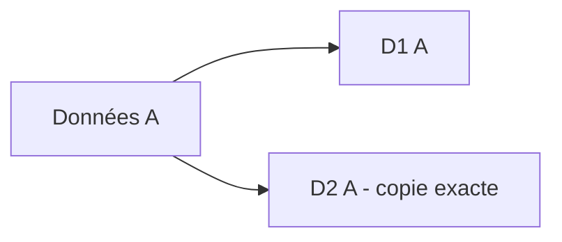

---

### RAID 5 — Striping + parité XOR tournante

#### Bloc et stripe

- **Un bloc** = la plus petite unité de données écrite sur un disque (ex. 64 Ko)
- **Un stripe** = une rangée de blocs répartis simultanément sur tous les disques

```
           D1      D2      D3
Stripe 1 [ A1  ][ A2  ][ P   ]   ← une rangée = 1 stripe
Stripe 2 [ B1  ][ P   ][ B2  ]
Stripe 3 [ P   ][ C1  ][ C2  ]
```

Chaque disque physique contient donc une pile verticale de blocs, mélange de données et de parité :

```
D1 (disque physique)
├── bloc A1   (données, stripe 1)
├── bloc B1   (données, stripe 2)
└── bloc P    (parité, stripe 3)
```

#### Rotation de la parité

La parité ne tombe pas toujours sur le même disque — elle tourne à chaque stripe :

```
Stripe 1 → P est sur D3
Stripe 2 → P est sur D2
Stripe 3 → P est sur D1
```

Cela distribue la charge d'écriture équitablement entre tous les disques.

> C'est ce qui distingue le RAID 5 du **RAID 4**, où P est toujours sur le même disque — créant un goulot d'étranglement à chaque écriture :

```
RAID 4 :
Stripe 1 → P est sur D3   ← toujours D3
Stripe 2 → P est sur D3   ← toujours D3
Stripe 3 → P est sur D3   ← D3 surchargé
```

#### Vue par stripe (RAID 5)

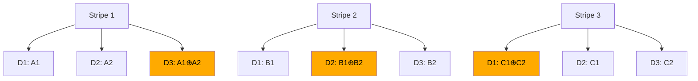

🟠 Blocs oranges = blocs de parité — physiquement stockés sur les disques, répartis par rotation.

---

### RAID 6 — Striping + double parité tournante

Comme le RAID 5 mais avec **deux blocs de parité indépendants (P et Q)** qui tournent également entre les disques. Survit à la perte de 2 disques simultanément.

- **P** = XOR simple → reconstruit 1 disque perdu
- **Q** = Reed-Solomon → reconstruit même si P est aussi perdu

```
           D1       D2       D3       D4
Stripe 1 [ A1   ][ A2   ][ P    ][ Q    ]
Stripe 2 [ B1   ][ P    ][ Q    ][ B2   ]
Stripe 3 [ P    ][ Q    ][ C1   ][ C2   ]
Stripe 4 [ Q    ][ D1   ][ D2   ][ P    ]
```

Chaque disque physique contient donc un mix des quatre types de blocs :

```
D1 (disque physique)
├── A1   (données, stripe 1)
├── B1   (données, stripe 2)
├── P    (parité XOR, stripe 3)
└── Q    (Reed-Solomon, stripe 4)
```

La logique est la même qu'en RAID 5 — distribuer la charge sur tous les disques pour éviter qu'un seul soit surchargé. Ici on distribue **deux** blocs de parité au lieu d'un, mais le principe de rotation reste identique.

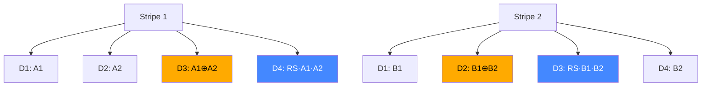

🟠 Orange = parité P (XOR) — 🔵 Bleu = parité Q (Reed-Solomon)

#### Scénarios de reconstruction RAID 6

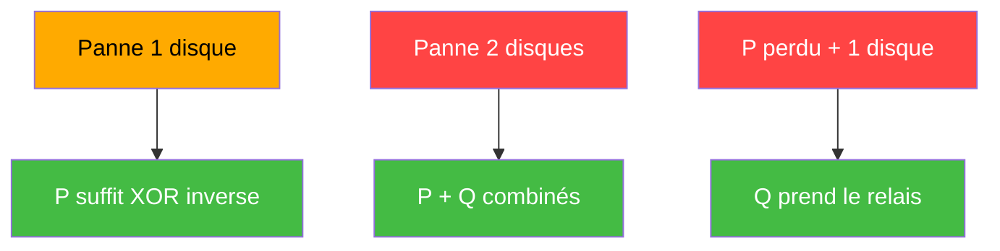

---

## Pourquoi XOR ne suffit pas pour 2 pannes

Avec 3 disques + P (XOR) :

```
D1=3   D2=5   D3=6   P = 3⊕5⊕6 = 0
```

Si D1 et D2 tombent simultanément :

```
D1=?   D2=?   D3=6   P=0

On sait que : D1⊕D2⊕6 = 0
Donc        : D1⊕D2   = 6

→ infinité de solutions : (1,7) (2,4) (3,5)...
  impossible de déterminer D1 et D2 séparément
```

XOR donne une **somme sans identité** — impossible de résoudre deux inconnues avec une seule équation.

---

## Reed-Solomon — principe

Reed-Solomon traite les données comme des **points sur une courbe polynomiale** :

```
Polynôme :  f(x) = A1·x² + A2·x + A3

D1 = f(1)
D2 = f(2)
D3 = f(3)
P  = f(4)   ← parité XOR
Q  = f(5)   ← point supplémentaire sur la courbe
```

Avec 2 points connus, on peut toujours reconstruire un polynôme de degré 2 :

```
2 disques perdus = 2 inconnues
P + Q            = 2 équations indépendantes
→ système soluble, solution unique
```

### Pourquoi ne pas utiliser Reed-Solomon partout ?

||XOR (P)|Reed-Solomon (Q)|
|---|---|---|
|Calcul|Ultra rapide|Coûteux en CPU|
|Reconstruction|Simple|Complexe|
|Tolère|1 panne|2 pannes|

C'est un **compromis coût/bénéfice** : RS n'est utilisé que quand on a besoin de tolérer 2 pannes simultanées, car il alourdit chaque opération d'écriture.

---

## Les RAID composés (nested RAID)

### RAID 10 — Mirror + Stripe

On crée des paires miroir (RAID 1), puis on stripe (RAID 0) entre elles.

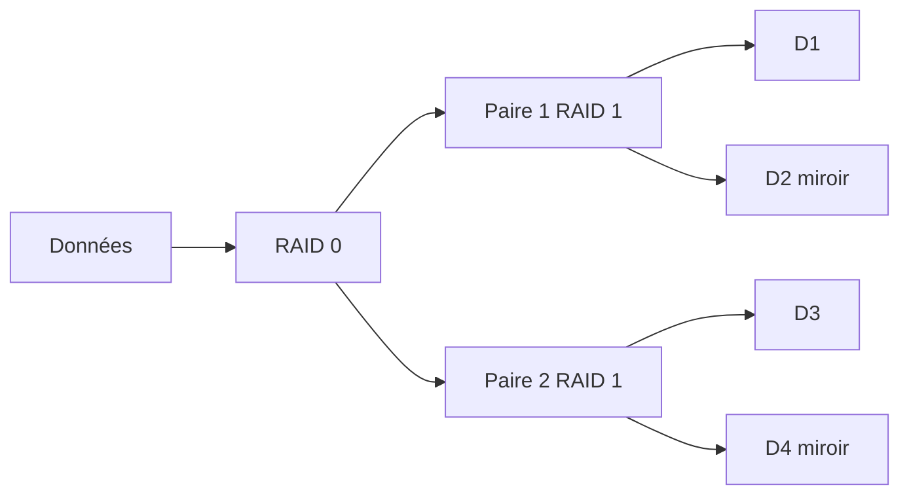

- ✅ Failover par paire + load balancing entre paires
- ❌ Capacité utile = 50%
- 📌 Idéal pour les bases de données à forte charge

---

### RAID 01 — Stripe + Mirror

On stripe d'abord, puis on duplique le groupe entier. Moins résilient que le RAID 10.

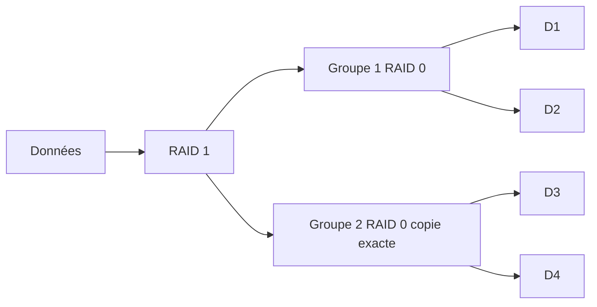

---

### RAID 50 — RAID 5 + Stripe

Plusieurs groupes RAID 5 sont striés ensemble. Dans chaque groupe, la parité tourne entre les disques physiques.

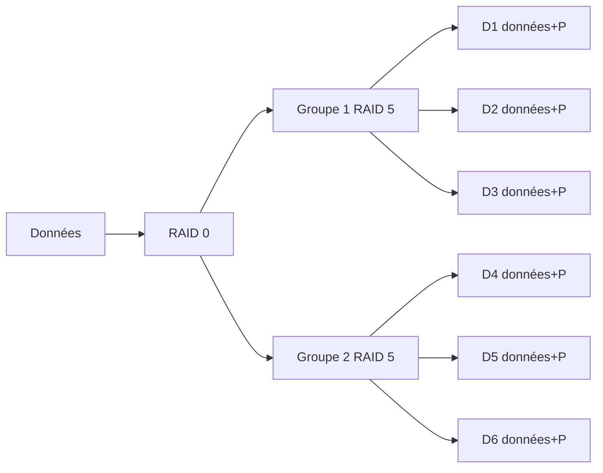

> Chaque disque contient un mix données/parité selon le stripe — P tourne entre D1, D2, D3 dans le groupe 1.

---

### RAID 60 — RAID 6 + Stripe

Comme le RAID 50 mais avec double parité (P+Q) tournante par groupe. Tolère 2 disques défaillants par groupe.

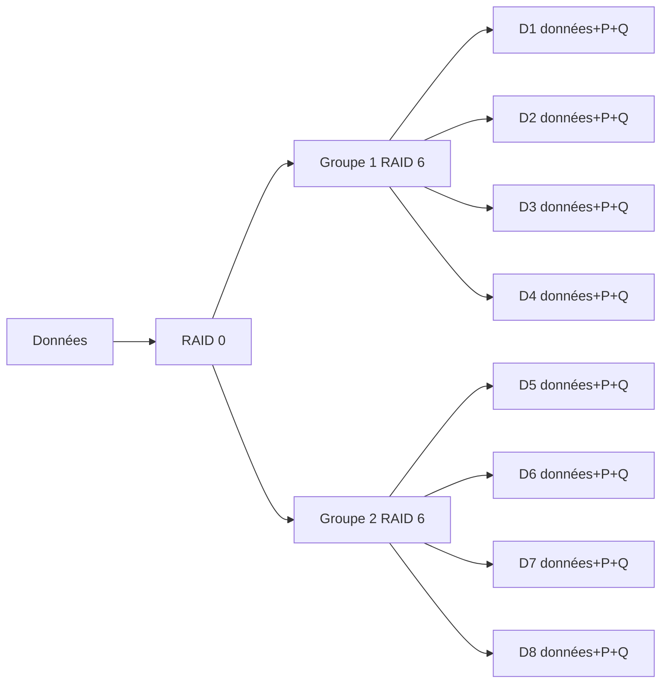

> P (XOR) et Q (Reed-Solomon) tournent tous les deux entre les disques de chaque groupe.

---

## Failover et Load Balancing

### Failover — RAID 1 (état normal)


### Failover — RAID 1 (après panne)

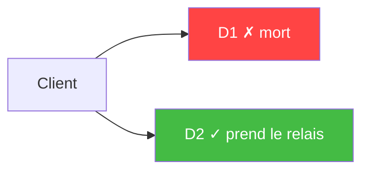

### Failover — RAID 5 (reconstruction par parité tournante)

Quand un disque tombe, le système recalcule les données manquantes via XOR à partir des blocs survivants — peu importe que le bloc perdu soit une donnée ou un bloc de parité.

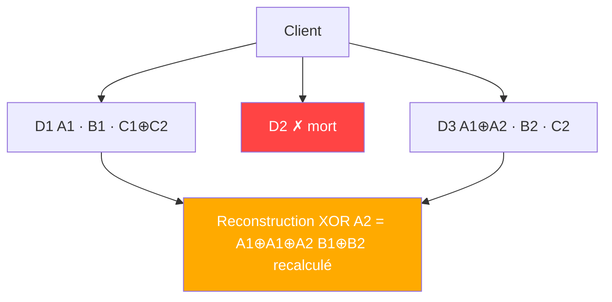

### Load Balancing — RAID 0

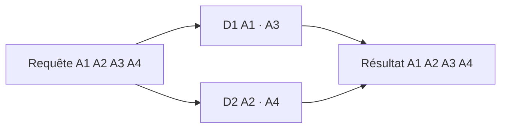

### Failover + Load Balancing — RAID 10 (après panne)

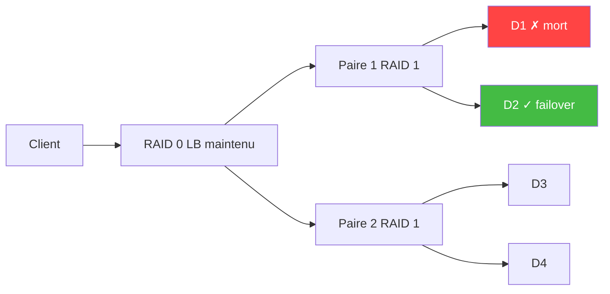

---

## Résumé comparatif

|RAID|Redondance|Perf. lecture|Perf. écriture|Capacité|Usage typique|
|---|---|---|---|---|---|
|0|❌|⬆⬆|⬆⬆|100%|Cache, vidéo|
|1|✅ 1 disque|⬆|➡|50%|OS, petits serveurs|
|5|✅ 1 disque|⬆|➡|(n-1)/n|Serveurs fichiers|
|6|✅ 2 disques|⬆|⬇|(n-2)/n|Archivage|
|10|✅ 1/paire|⬆⬆|⬆|50%|BDD, prod critique|
|50|✅ 1/groupe|⬆⬆|⬆|bonne|NAS, SAN|
|60|✅ 2/groupe|⬆⬆|➡|correcte|Datacenter|
